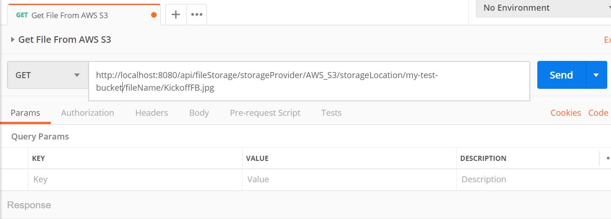
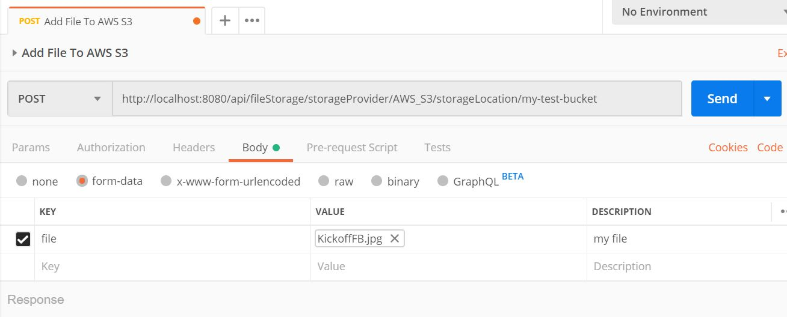
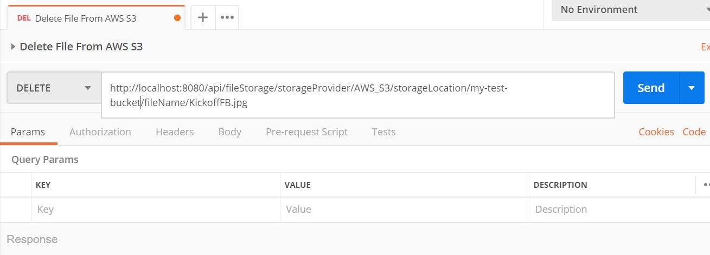
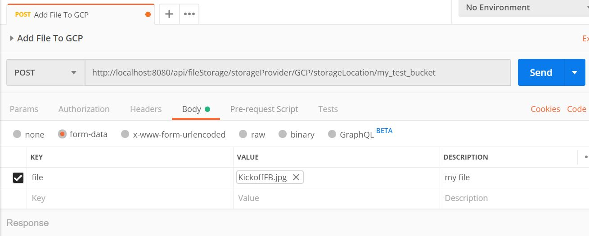

# Storage Service Requests

Examples of HTTP requests you can make to this application to interact with file storage providers.


## AWS S3

### Get File

```
GET: http://localhost:8080/api/fileStorage/storageProvider/AWS_S3/storageLocation/my-test-bucket/fileName/KickoffFB.jpg
```

note: you can go to the link in your browser to download the file



### Upload File

```
POST: http://localhost:8080/api/fileStorage/storageProvider/AWS_S3/storageLocation/my-test-bucket
```



### Delete File

```
DELETE: http://localhost:8080/api/fileStorage/storageProvider/AWS_S3/storageLocation/my-test-bucket/fileName/KickoffFB.jpg
```




## GCP Cloud Storage

### Get File

```
GET: http://localhost:8080/api/fileStorage/storageProvider/GCP/storageLocation/my_test_bucket/fileName/KickoffFB.jpg
```

note: you can go to the link in your browser to download the file


### Upload File

```
POST: http://localhost:8080/api/fileStorage/storageProvider/GCP/storageLocation/my_test_bucket
```



### Delete File

```
DELETE: http://localhost:8080/api/fileStorage/storageProvider/GCP/storageLocation/my_test_bucket/fileName/KickoffFB.jpg
```


